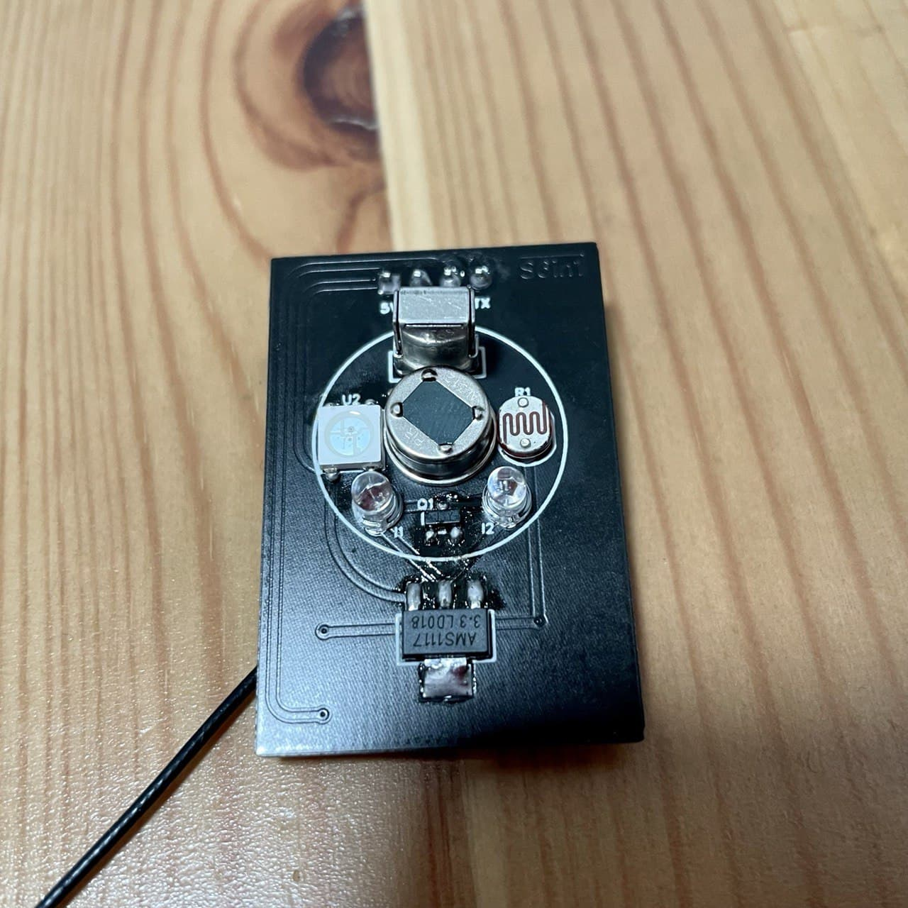
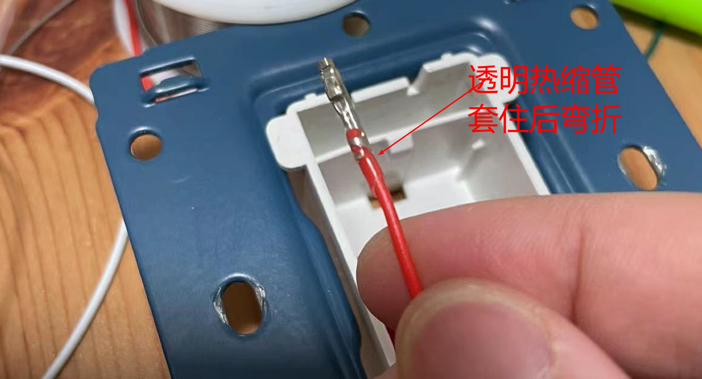
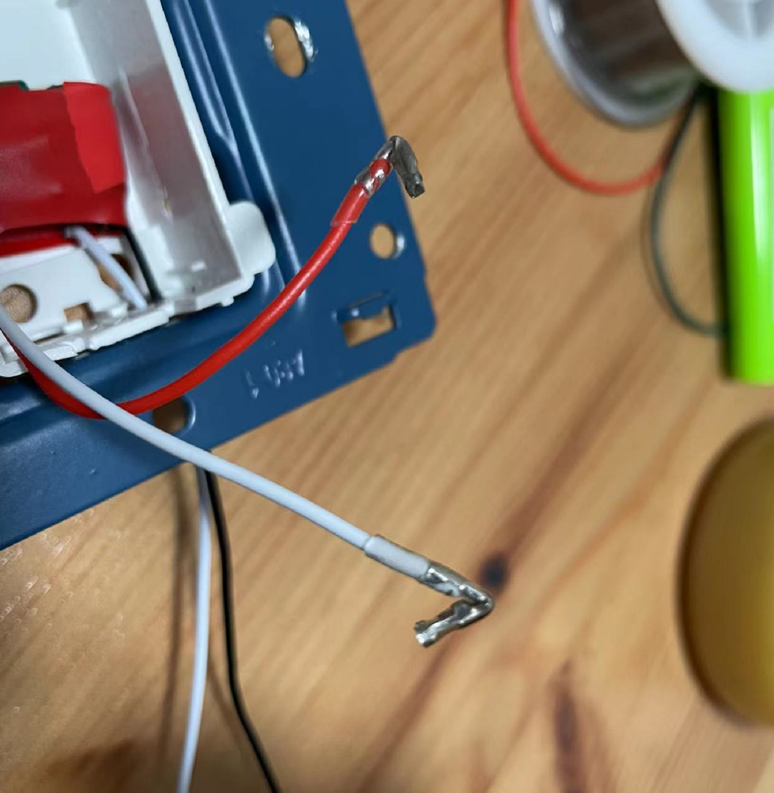
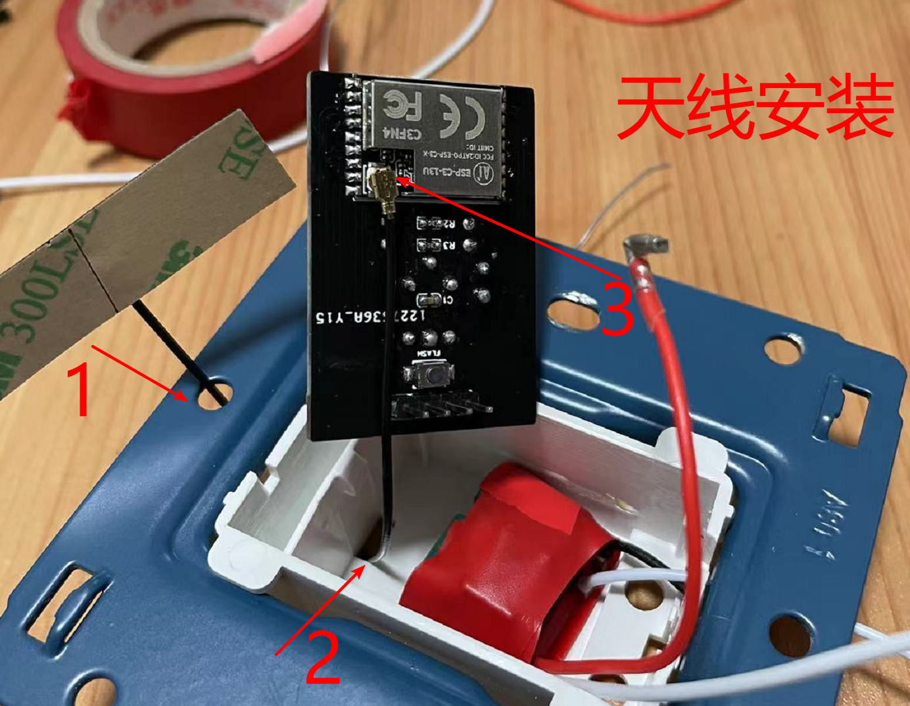
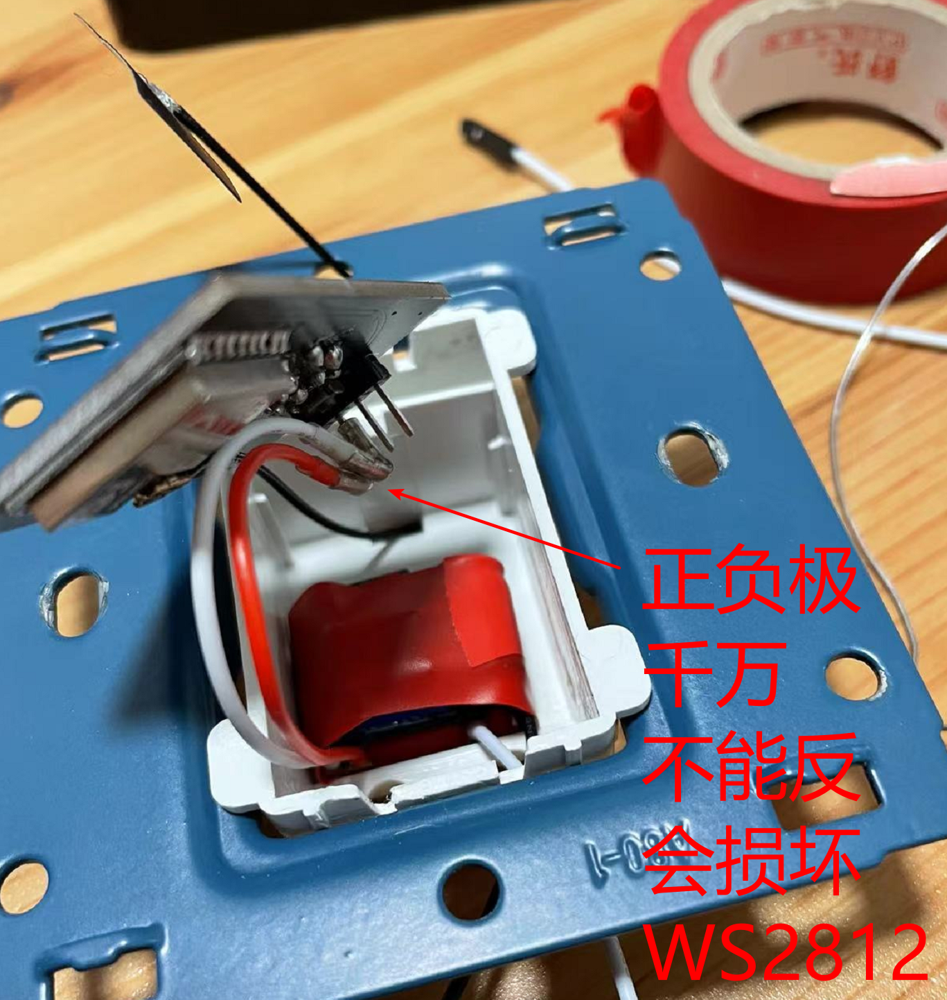
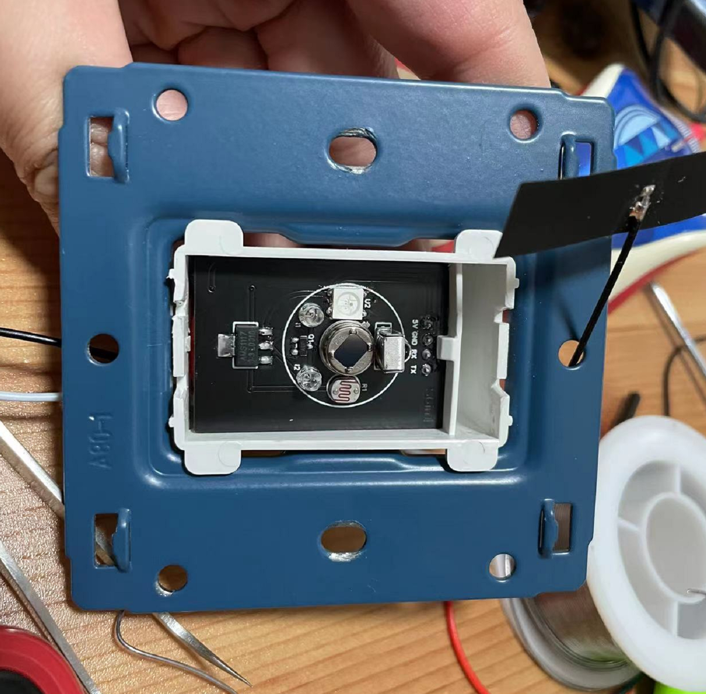
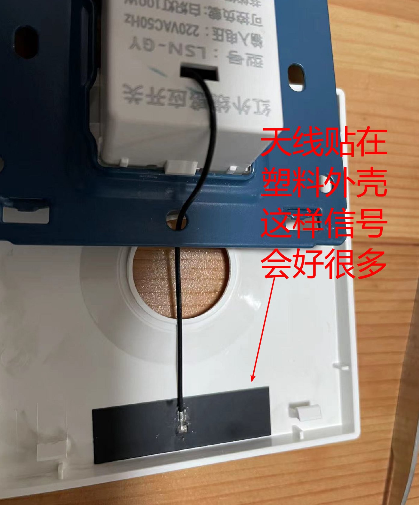
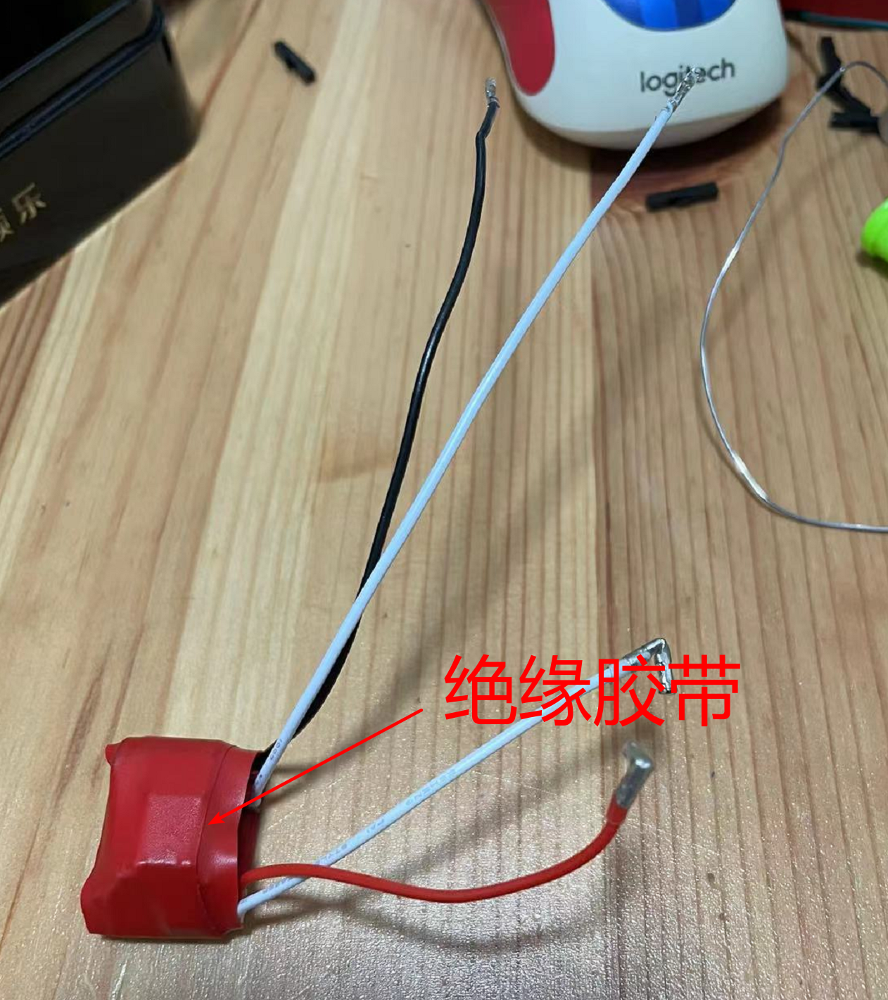

# S6in1

## 简介



讨论群: `810581215`

全新的六合一传感器（红外发射、红外接收、人体传感器、亮度传感器、RGB 指示灯、蓝牙）

升级点:

1. 在上一次[S5in1](https://github.com/liwei19920307/S5in1)的基础上用`ESP32C3`（增加了蓝牙功能）替换`ESP8266`，增加了对低功耗设备数据采集的能力

2. 替换原来单色`LED`为 W`S2812B（RGB）`

3. 重新设计人体传感器部分，更加简单可靠

4. 全部曲线，双面覆铜减少干扰

问题:

这个项目硬件部分其实半年前就好了，一直没放出来是由于`epshome` 并未完全支持`ESP32C3`，还有一点`bug`。红外发射和红外接收不发同时使用，只能二选一，具体修复时间还要`esphome`等。但等到现在了`esphome`对`C3`的支持还是不是很好，所以就先开放出来希望早点解决。目前所有传感器都测试过，没有问题

以下仅提供核心内容，具体步骤参考[S5in1](https://github.com/liwei19920307/S5in1)

## `材料清单`

| 名称                                        | 型号        | 数量 |  PCB 标注  |                           链接                            |
| ------------------------------------------- | ----------- | ---: | :--------: | :-------------------------------------------------------: |
| WS2812B 幻彩 LED 灯带 5V 全彩灯条 5050 灯珠 | 30 1 米     |    1 |     U2     | [购买](https://item.taobao.com/item.htm?id=523924102690)  |
| 单排针 间距 2.54MM                          | 1 \* 40P    |    1 |     H1     | [购买](https://item.taobao.com/item.htm?id=553875848479)  |
| VS/HX1838/PC638 红外接收头                  |             |    1 |     U3     | [购买](https://item.taobao.com/item.htm?id=522552967131)  |
| 3MM 940nm 红外发射管                        |             |    2 |  I1 / I2   | [购买](https://item.taobao.com/item.htm?id=522572541770)  |
| 光敏电阻 5516                               | 5516        |    1 |     R1     | [购买](https://item.taobao.com/item.htm?id=522556415238)  |
| PIR AL312 热释电红外传感器                  | AL312       |    1 |   AL312    | [购买](https://item.taobao.com/item.htm?id=604332532927)  |
| AMS1117-3.3 稳压电源芯片降压 IC             | AMS1117-3.3 |    1 |     U1     | [购买](https://item.taobao.com/item.htm?id=522579028878)  |
| ESP-C3-13U 模块                             |             |    1 | ESP-C3-13U | [购买](https://item.taobao.com/item.htm?id=652413887471)  |
| 3\*4 龟仔/微动/轻触开关                     |             |    1 |   FLASH    | [购买](https://item.taobao.com/item.htm?id=546724645617)  |
| 贴片 S8050 J3Y 贴片三极管 500MA SOT-23      |             |    1 |     Q1     | [购买](https://item.taobao.com/item.htm?id=522577964105)  |
| 0603 贴片电阻 1MΩ 1 兆欧 1/10W 精度 ±1%     |             |    1 |     R2     | [购买](https://item.taobao.com/item.htm?id=525898476191)  |
| 0603 贴片电阻 10KΩ 10 千欧 1/10W 精度 ±1%   |             |    1 |     R3     | [购买](https://item.taobao.com/item.htm?id=525777943950)  |
| 正品 0603 贴片电容 50V 100NF ±10%           |             |    1 |     C1     | [购买](https://item.taobao.com/item.htm?id=537743724825)  |
| 40P 彩排杜邦线                              | 母对母 21CM |    1 |     -      | [购买](https://item.taobao.com/item.htm?id=558182761958)  |
| 220V 转 5V700mA 电源模块                    | 5V700mA     |    1 |     -      | [购买](https://detail.tmall.com/item.htm?id=543443029399) |
| 86 型人体感应开关面板                       |             |    1 |     -      | [购买](https://detail.tmall.com/item.htm?id=622077644993) |
| 2.4G 内置柔性 FPC 软天线                    | IPEX 接头   |    1 |     -      | [购买](https://item.taobao.com/item.htm?id=574057911861)  |

## `ESPHome`

```yaml
esphome:
  name: s6in1
  platformio_options:
    platform: https://github.com/tasmota/platform-espressif32.git
    platform_packages:
      - framework-arduinoespressif32@https://github.com/espressif/arduino-esp32.git#2.0.2
    board_build.flash_mode: dio

esp32:
  board: esp32-c3-devkitm-1
  framework:
    type: arduino

logger:

api:
  password: !secret api_password

ota:
  password: !secret ota_password

wifi:
  ssid: !secret wifi_ssid
  password: !secret wifi_password
  fast_connect: on

web_server:
  port: 80

# 重启
switch:
  - platform: restart
    name: "s6in1_reboot"

# 蓝牙
esp32_ble_tracker:

# WS2812
light:
  - platform: neopixelbus
    variant: WS2812X
    type: GRB
    pin: 0
    num_leds: 1
    name: "s6in1_light"
    method: ESP32_RMT_1

# 红外发射（生效请注释掉红外接收，esphome bug）
remote_transmitter:
  pin: 2
  carrier_duty_percent: 50%

# 例子发射raw码遥控电视
# 由于esphome的不支持，目前还不支持通过api调用红外，等待esphome修复bug
# 发射的raw码可以用遥控器对着传感器按下，在web日志里可以看到Received Raw: 开头的日志，不同遥控器行数不同，将没用的日志信息删除合并后就是raw的code，可以学习任何红外遥控器
button:
  - platform: template
    name: "master_s6in1_tv_on_off"
    on_press:
      - remote_transmitter.transmit_raw:
          carrier_frequency: 38kHz
          code: [9045, -4500, 585, -520, 578, -527, 580, -525, 578, -527, 586, -518, 579, -525, 580, -525, 585, -519, 569, -1641, 583, -1626, 585, -1624, 580, -1628, 586, -1677, 579, -1630, 580, -526, 583, -1625, 586, -1623, 586, -519, 586, -1622, 582, -1628, 587, -518, 580, -524, 585, -520, 586, -519, 584, -520, 585, -1650, 584, -521, 588, -517, 580, -1630, 584, -1624, 585, -1624, 586, -1623, 585]

# 红外接收（生效请注释掉红外发射，esphome bug）
remote_receiver:
  # 没用的占位,必须要，esphome有bug
  - id: s6in1_rr_null
    pin:
      number: 5
      inverted: yes
    dump: raw
  # 实际红外接收
  - id: s6in1_rr
    pin:
      number: 1
      inverted: yes
    dump: raw

sensor:
  # 运行时间
  - platform: uptime
    name: "s6in1_uptime"
  # WiFi强度
  - platform: wifi_signal
    name: "s6in1_signal"
    update_interval: 60s
  # 亮度
  - platform: adc
    pin: 3
    name: "s6in1_brightness"
    attenuation: 11db
    update_interval: 5s
    unit_of_measurement: "%"
    icon: "mdi:brightness-6"
    accuracy_decimals: 0
    filters:
      - lambda: |-
          return ( 3 - x ) / 0.03;

# 热释电动作传感器
binary_sensor:
  - platform: gpio
    pin: 4
    name: "s6in1_pir"
    device_class: motion
```

## `细节`








