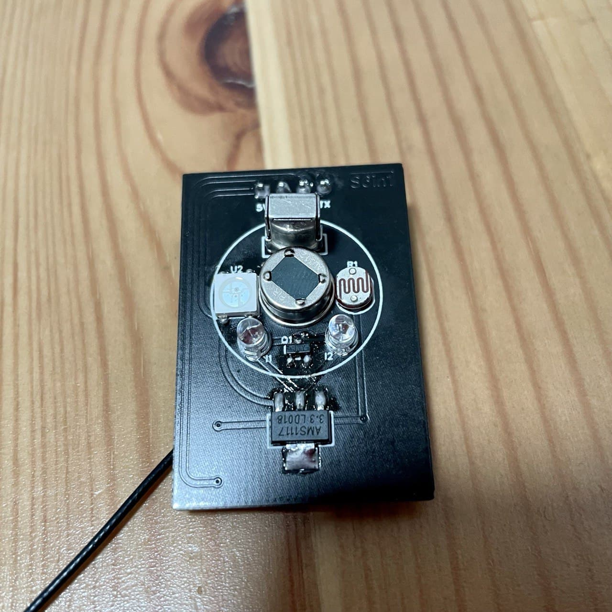

# S6in1

## 简介



全新的六合一传感器（红外发射、红外接收、人体传感器、亮度传感器、RGB指示灯、蓝牙）

升级点：

```
1、在上一次S5in1的基础上用ESP32C3（增加了蓝牙功能）替换ESP8266，增加了对低功耗设备数据采集的能力

2、替换原来单色LED为WS2812B（RGB）

3、重新设计人体传感器部分，更加简单可靠，误触更少

4、全部曲线，双面覆铜减少干扰
```

目前ESPHome对ESP32C3支持还不够完善，等ESPHome的BUG解决后上线